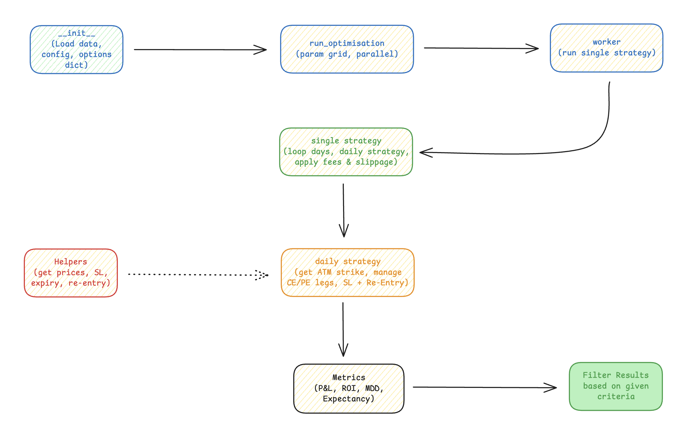

# qback - Options Backtesting Engine
<!-- cmd-k v :::: for markdown preview-->

A options backtesting engine that tests multiple parameter combinations to find profitable trading strategies.

## Features

- **Parameter Optimization**: Tests all combinations of entry/exit times, strike offsets, stop-loss rules, and re-entry logic
- **Multiple Stop-Loss Types**: Percentage of premium, points-based
- **Re-entry Logic**: Configurable re-entry attempts after stop-loss hits
- **Filtering**: Filters strategies based on ROI, Return/MDD ratio, and win rate
- **Detailed Trade Analysis**: Exports trade-by-trade results for best strategies


## Quick Start

1. **Install dependencies**:
   ```bash
   pip install -r requirements.txt
   ```

2. **Configure parameters and fees**:
   Edit `config.yaml` to set entry/exit times, stop-loss values, re-entry logic, brokerage, slippage, and transaction fees. All grid-search and fee values are controlled here.

3. **Run backtesting**:
   ```bash
   cd src
   python main.py
   ```

## Data Format

### Index Data (CSV)
```
timestamp,index_close
2021-01-04 09:15:00,19796.9
2021-01-04 09:16:00,19796.53
...
```

### Options Data (CSV)
```
timestamp,expiry,strike,option_type,open,high,low,close,volume,oi
2021-01-04 09:15:00,2021-01-10,19700,CE,162.94,166.25,160.88,164.19,302,2101
...
```


## Parameters & Fees (Configurable)

All parameter ranges and fees are set in `config.yaml`:

- **Entry/Exit Times**: List of times (HH:MM)
- **Strike Offsets**: List offsets
- **Option Types**: CE, PE, BOTH
- **Max Re-entries**: List of allowed re-entries
- **Re-entry Strategies**: List of strategies
- **Stop-Loss Types & Values**: Dict of stop-loss types and their value lists
- **Brokerage, Slippage, Transaction Fees**: All fee and cost parameters

**Total Combinations**: Product of all parameter list lengths (see config.yaml)

All possible combinations of the above parameters are tested (absolute brute force). Each stop-loss type is paired with all its values, and every re-entry strategy is used for every parameter set.

## Output Files

- `backtest_results.csv`: All strategy results
- `filtered_strategies.csv`: Strategies passing profitability filters
- `trades_best_strategy.csv`: Detailed trades for best strategy


## Flow of the Engine


## File Structure
```
aux/
├── convert_to_parquet.py      # helper script to convert CSV -> Parquet
└── test_notebook.py           # Notebook for data exploration
└── Nifty-Index-Monthly-Data.csv
└── Nifty-Options-Weekly.csv
└── test_notebook.py           # Notebook for data exploration
src/
├── backtest_engine.py         # Core backtesting logic (reads config)
└── main.py                    # Parameter grid and execution
└── config.yaml                # All parameter ranges and fees (edit here)
└── Nifty-Index-Monthly-Data.parquet
└── Nifty-Options-Weekly.parquet
README.md
requirements.txt               # dependencies
workflow.jpg
```
